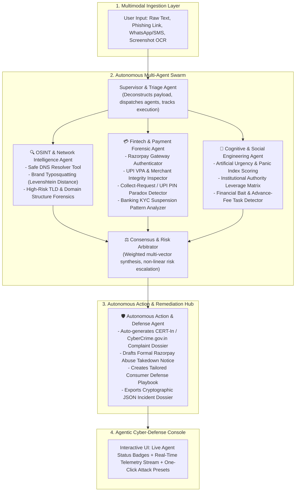

# 🛡️ Sentinel AI 2.0
### Autonomous Multi-Agent Financial Fraud & Phishing Defense Platform
**Prepared for the Razorpay Buildathon – India’s First Agentic Hiring Hackathon**

[](https://www.python.org/)
[]()
[]()
[](https://razorpay.com/buildathon/)

---

## 📌 Executive Summary

Digital payment fraud in India has evolved into hyper-targeted, multi-vector attacks:
- **Spoofed Payment Gateways** masquerading as Razorpay hosted checkouts (`pages.razorpay.com` lookalikes).
- **UPI Collect Request Traps** tricking victims into entering UPI PINs to "claim refunds or cashbacks".
- **Social Engineering & Panic Lures** (fake SBI/HDFC KYC suspensions, electricity disconnections, and Telegram job deposits).

**Sentinel AI 2.0** is an **Autonomous Multi-Agent Cyber & Fintech Defense Platform**. Instead of rigid static rules, Sentinel deploys a **Swarm of 4 Specialized Autonomous Agents** that interrogate threats across network infrastructure, payment mechanics, and cognitive psychology—synthesizing real-time risk consensus and executing **automated remediation countermeasures**.

---

## 🚀 The Quantum Leap: Sentinel 1.0 vs Sentinel 2.0

| Feature Area | Sentinel AI 1.0 (Initial Prototype) | Sentinel AI 2.0 (Buildathon Edition) |
|---|---|---|
| **System Architecture** | Single-file script with static regex / keyword matching (`if "pay" in text`) | **Autonomous Multi-Agent Swarm** with 4 specialized collaborative agents |
| **Domain & OSINT Forensics** | Basic substring checks | **Algorithmic Levenshtein distance**, live DNS resolver, and brand typosquatting tools |
| **Fintech & Payment Intelligence** | None (treated all links as generic text) | **Razorpay gateway authenticator** (`pages.razorpay.com`), UPI VPA inspector, and PIN paradox detector |
| **Incident Remediation** | Passive static score on screen | **Autonomous Remediation Agent** auto-generating CERT-In complaint dossiers & `abuse@razorpay.com` takedowns |
| **Telemetry & Observability** | No telemetry or internal visibility | **Real-Time Server-Sent Events (SSE)** streaming live agent thoughts and tool invocations |
| **Multimodal Vision** | Fragile external Tesseract dependency | **RapidOCR ONNX Neural Vision** running 100% in-memory with zero system dependencies |

---

## 🏗️ Multi-Agent System Architecture



---

## 🤖 The Autonomous Agents

| Agent | Icon | Role & Key Autonomous Tools |
|---|---|---|
| **OSINT & Network Intelligence Agent** | 🔍 | Interrogates DNS, calculates Levenshtein edit distance for brand lookalikes (`razorpay-secure.xyz` vs `razorpay.com`), inspects TLD risk, and unmasks nested subdomains. |
| **Fintech & Payment Forensic Agent** | 💳 | Validates authentic Razorpay payment links (`pages.razorpay.com`, `rzp.io`), uncovers spoofed merchant VPAs on personal PSPs (`support-rzp@okaxis`), and flags "Enter PIN to receive" payment paradoxes. |
| **Cognitive & Social Engineering Agent** | 🧠 | Dissects psychological coercion, artificial panic countdowns ("within 24 hours"), authority threats (RBI, Police, Bank KYC), and task-deposit baits. |
| **Autonomous Action & Defense Agent** | 🛡️ | Synthesizes threat telemetry to generate official Cybercrime portal complaint drafts, Razorpay abuse takedown templates, and step-by-step user defense protocols. |

---

## 💡 Why This Fits Razorpay Perfectly

1. **Brand & Merchant Infrastructure Protection**:
   Automatically distinguishes genuine Razorpay hosted pages (`pages.razorpay.com/pl_...`, `rzp.io/l/...`) from criminal lookalikes, preventing brand erosion and merchant spoofing.
2. **UPI Fraud Mitigation**:
   Enforces NPCI architectural rules: immediately flags "Enter UPI PIN to receive money" as a mathematical impossibility.
3. **Automated Incident Response**:
   Instead of just giving a score, it **acts**: auto-drafts takedown notices to `abuse@razorpay.com` and structured complaint payloads for Indian law enforcement (1930 Helpline).

---

## 🚀 Quickstart & Setup Guide

### 1. Clone & Navigate to Project
```bash
cd "c:\Users\Anshul\Desktop\Sentinel AI"
```

### 2. Install Dependencies
```bash
pip install -r backend/requirements.txt
```

### 3. Run Automated Swarm Unit Tests
```bash
python -m unittest discover -s tests
```

### 4. Start Backend API Server
```bash
python backend/app.py
```
*Server runs at `http://127.0.0.1:5000`*

### 5. Launch Cyber Defense Console
Open `frontend/index.html` in any modern web browser or run a local static server:
```bash
# Optional: Open directly in browser
start frontend/index.html
```

---

## 🧪 Included Attack Scenario Presets (For Judges)

The console includes **5 One-Click Attack Presets** ready for instant evaluation:

1. **🎯 Fake Razorpay Phishing**: Impersonation of Razorpay settlement desk on `.xyz` domain with personal VPA handle.
2. **💸 UPI PIN Reversal Trap**: Fake Swiggy cashback refund bait tricking user to enter UPI PIN.
3. **🏦 Bank KYC Panic SMS**: SBI YONO account block threat with unauthorized update portal link.
4. **💼 Telegram Job Bait**: Part-time YouTube video reviewer task requiring an upfront deposit.
5. **✅ Legit Invoice**: Authentic Razorpay payment receipt for Urban Company transaction.

---

## 📂 Project Structure

```
Sentinel AI/
├── backend/
│   ├── app.py                      # REST & SSE Streaming Multi-Agent Server
│   ├── requirements.txt            # Python Dependencies
│   └── test_ocr.py                 # OCR verification script
├── core/
│   ├── config.py                   # Threat Intelligence Dictionaries & Trusted Brand Registry
│   └── orchestrator.py             # Swarm Orchestrator, Blackboard Memory & Risk Arbitrator
├── agents/
│   ├── base_agent.py               # Abstract Agent Lifecycle with Telemetry Stream
│   ├── osint_agent.py              # OSINT & Network Intelligence Agent
│   ├── fintech_agent.py            # Razorpay & UPI Payment Forensic Agent
│   ├── cognitive_agent.py          # Social Engineering & Cognitive Reasoning Agent
│   └── remediation_agent.py        # Autonomous Action & Defense Agent
├── tools/
│   ├── domain_tools.py             # DNS, Levenshtein Typosquatting, TLD Inspection
│   ├── upi_tools.py                # UPI VPA Parsing, Payment Gateway Authenticator
│   └── reporting_tools.py          # Cybercrime & Razorpay Takedown Generator
├── frontend/
│   ├── index.html                  # Agentic Cyber-Defense Console
│   ├── style.css                   # Obsidian Cyberpunk Glassmorphic Theme
│   └── script.js                   # SSE Streaming Client & Remediation Controller
├── tests/
│   └── test_swarm.py               # Comprehensive Automated Unit Test Suite
├── Demo inputs/                    # Benchmark Attack Datasets
└── README.md                       # Hackathon Submission Dossier
```

---

## ⚖️ License
Built for the **Razorpay Buildathon 2026**. Open for evaluation and AI Intern hiring workflow.
