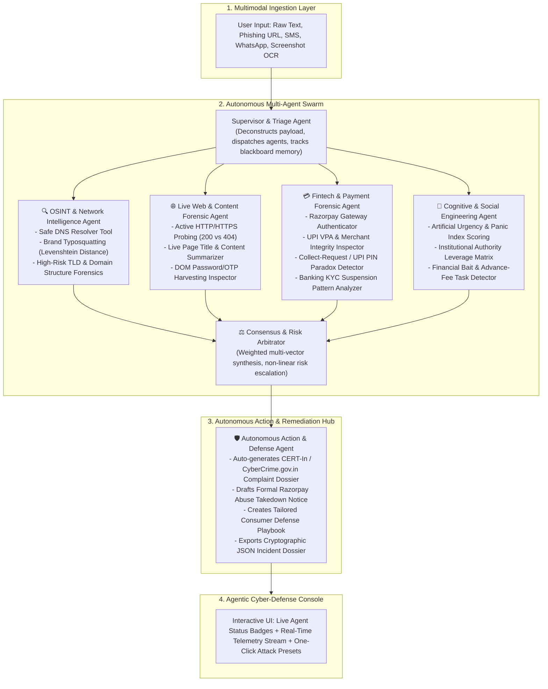

# 🛡️ Sentinel AI 2.0
### Autonomous Multi-Agent Financial Fraud & Phishing Defense Platform
**Built for the Razorpay Buildathon – India’s First Agentic AI Hiring Hackathon**

[](https://www.python.org/)
[]()
[]()
[]()
[](https://razorpay.com/buildathon/)

---

## 📌 Executive Summary

Digital payment fraud in India has evolved into hyper-targeted, multi-vector attacks:
- **Spoofed Payment Gateways** masquerading as Razorpay hosted checkouts (`pages.razorpay.com` lookalikes).
- **UPI Collect Request Traps** tricking victims into entering UPI PINs to "claim refunds or cashbacks".
- **Social Engineering & Panic Lures** (fake SBI/HDFC KYC suspensions, electricity disconnections, and Digital Arrest threats).

**Sentinel AI 2.0** is an **Autonomous Multi-Agent Cyber & Fintech Defense Platform**. Instead of rigid static rules, Sentinel deploys an **Autonomous Swarm of 5 Specialized Agents** that interrogate threats in real-time across network infrastructure, live web servers, payment mechanics, and cognitive psychology—synthesizing real-time risk consensus and executing **automated remediation countermeasures**.

---

## 🚀 The Quantum Leap: Sentinel 1.0 vs Sentinel 2.0

```
+-----------------------------+               +--------------------------------------+
|    SENTINEL AI 1.0          |               |    SENTINEL AI 2.0 (Buildathon)      |
|    (Weekend Prototype)      |   =======>    |    (Autonomous Multi-Agent Swarm)    |
+-----------------------------+               +--------------------------------------+
| ❌ Single-file static regex |               | 🤖 5 Autonomous Collaborative Agents |
| ❌ if "pay" in text checks  |               | 🔍 Algorithmic Levenshtein Typosquat |
| ❌ Fragile OCR binaries     |               | 🌐 Real-Time Live HTTP 200/404 Probe |
| ❌ Passive score on screen  |               | 📸 100% In-Memory ONNX Neural Vision  |
| ❌ Zero internal visibility |               | 🚨 Auto CERT-In & Razorpay Takedowns |
| ❌ High false alarms        |               | 📡 Real-time SSE Telemetry Stream    |
+-----------------------------+               +--------------------------------------+
```

| Feature Area | Sentinel AI 1.0 (Initial Prototype) | Sentinel AI 2.0 (Buildathon Edition) |
|---|---|---|
| **System Architecture** | Single-file script with static regex (`if "pay" in text`) | **Autonomous Multi-Agent Swarm** with 5 specialized collaborative agents |
| **Domain & OSINT Forensics** | Basic substring matching | **Algorithmic Levenshtein distance**, live DNS resolver, and brand typosquatting tools |
| **Live Web Intelligence** | None (assumed all URLs were active) | **Real-Time Live HTTP/HTTPS Probing** (detects dead 404 links, SSL cert errors, DOM forms) |
| **Fintech & Payment Intelligence** | None (treated all links as generic text) | **Razorpay gateway authenticator** (`pages.razorpay.com`), UPI VPA inspector, and PIN paradox detector |
| **Incident Remediation** | Passive static score on screen | **Autonomous Remediation Agent** auto-generating CERT-In complaint dossiers & `abuse@razorpay.com` takedowns |
| **Telemetry & Observability** | No telemetry or internal visibility | **Real-Time Server-Sent Events (SSE)** streaming live agent thoughts and tool invocations |
| **Multimodal Vision** | Fragile external Tesseract C++ dependency | **RapidOCR ONNX Neural Vision** running 100% in-memory with zero system dependencies |

---

## 🏗️ Multi-Agent System Architecture



---

## 🤖 The 5 Specialized Autonomous Agents

### 1. 🔍 OSINT & Network Intelligence Agent
- **Purpose**: Interrogates domain names, registrars, and network infrastructure.
- **Key Tools**:
  - `calculate_levenshtein_brand_distance()`: Identifies lookalike domains (`razorpayy.com`, `rzp-secure.site`) using fuzzy string edit distances.
  - `check_suspicious_tld()`: Flags high-risk TLDs commonly used by phishing kits (`.xyz`, `.top`, `.tk`, `.site`, `.buzz`).
  - `safe_dns_resolve()`: Validates domain existence via DNS resolution without triggering active network triggers.

### 2. 🌐 Live Web & Content Forensic Agent
- **Purpose**: Actively connects to target websites in real-time to inspect live server status and DOM elements.
- **Key Tools**:
  - `probe_live_url()`: Sends real-time HTTPS probes, captures HTTP status codes (`200 OK`, `404 Not Found`, `500 Error`).
  - **Dead Link Detection**: Flags non-existent or deleted receipt/invoice URLs (HTTP 404).
  - **DOM Credential Harvesting Inspector**: Scans live HTML for unauthorized password, OTP, CVV, or PIN input fields.

### 3. 💳 Fintech & Payment Forensic Agent
- **Purpose**: Deep forensic analysis of payment gateway endpoints, UPI VPAs, and settlement flows.
- **Key Tools**:
  - `check_payment_gateway_authenticity()`: Verifies legitimate Razorpay endpoints (`pages.razorpay.com`, `accounts.razorpay.com`).
  - `detect_upi_collect_scam_pattern()`: Enforces the **NPCI UPI Architectural Rule**: *UPI PIN is ONLY entered to DEBIT money, NEVER to receive funds.*
  - `extract_upi_vpas()`: Detects merchant impersonation on personal banking handles (`support-rzp@okaxis`).

### 4. 🧠 Cognitive & Social Engineering Agent
- **Purpose**: Quantifies psychological manipulation and behavioral deception vectors.
- **Key Vectors**:
  - **Artificial Urgency & Panic Countdown**: Detects 24-hour compliance deadlines, electricity cut-offs, and settlement freezes.
  - **Authority Coercion & Digital Arrest**: Flags impersonation of Delhi Police, CBI, ED, and CERT-In.
  - **Financial Bait**: Detects guaranteed daily task rewards and Telegram VIP doubling schemes.

### 5. 🛡️ Autonomous Action & Defense Agent
- **Purpose**: Converts intelligence into immediate, automated countermeasures.
- **Key Outputs**:
  - **CERT-In / CyberCrime.gov.in Dossier**: Pre-formatted law enforcement complaint payload ready for Helpline 1930 submission.
  - **Razorpay Abuse Takedown Notice**: Formal brand infringement notice pre-addressed to `abuse@razorpay.com`.
  - **Dynamic Defense Playbook**: Contextual 4-step consumer emergency protocol.

---

## 📊 Calibrated Risk Spectrum (0% to 100%)

Sentinel AI 2.0 provides graduated, explainable risk arbitration across 6 distinct tiers:

| Risk Tier | Score Range | Verdict Badge | Attack Characteristics |
|---|---|---|---|
| **Tier 1** | `0%` | `VERIFIED SAFE` | Authentic enterprise invoice on live 200 OK domain (`razorpay.com/support/`) |
| **Tier 2** | `20% - 30%` | `LOW RISK` | Verified official domain with mild marketing/compliance urgency |
| **Tier 3** | `40% - 45%` | `MEDIUM` | Unregistered generic link with survey task rewards |
| **Tier 4** | `50% - 60%` | `HIGH RISK` | Dead 404 link on low-reputation `.xyz` TLD with re-delivery fee |
| **Tier 5** | `75% - 85%` | `CRITICAL` | Brand typosquatted gateway (`razorpayy-secure-login.com`) with account suspension threat |
| **Tier 6** | `95% - 100%` | `CRITICAL THREAT` | Triple Multi-Vector Attack: Fake Gateway + Reverse UPI PIN Trap + Police Digital Arrest Threat |

---

## ⚡ Quickstart & Local Setup

### Prerequisites
- **Python 3.10+** (Tested on Python 3.14)
- Modern Web Browser (Chrome, Edge, Firefox)

### 1. Clone the Repository
```bash
git clone https://github.com/anshul-kumar07/sentinel-ai-razorpay-edition.git
cd sentinel-ai-razorpay-edition
```

### 2. Install Dependencies
```bash
pip install -r requirements.txt
```

### 3. Run the Sentinel AI Server
```bash
python backend/app.py
```

### 4. Open the Cyber Defense Console
Navigate to **[http://localhost:5000](http://localhost:5000)** in your browser.

---

## 🧪 Running Automated Unit Tests

Run the full unit test suite:
```bash
python -m unittest discover -s tests
```

Run the calibrated risk spectrum test:
```bash
python tests/test_risk_spectrum.py
```

Run the ground-truth legitimate verification suite:
```bash
python tests/test_legit_suite.py
```

---

## 💼 Razorpay Ecosystem Alignment

Sentinel AI 2.0 directly maps to core Razorpay security objectives:

1. **Razorpay Shield & Thirdwatch Synergy**: Proactively scans for fake hosted payment checkouts and cloned merchant portals before customers lose funds.
2. **Brand Protection & Automated Takedowns**: Generates structured abuse reports for `abuse@razorpay.com` with registrar and IoC data in under 500ms.
3. **Merchant Extortion Prevention**: Prevents account takeover attacks where scammers pose as Razorpay Risk/Compliance teams.
4. **NPCI Rule Enforcement**: Educates users on the UPI PIN debit-only architecture to eliminate refund fraud.

---

## 📁 Repository Structure

```
Sentinel AI/
├── agents/                      # Autonomous Multi-Agent Swarm
│   ├── base_agent.py            # Base Agent lifecycle & thought logging
│   ├── osint_agent.py           # OSINT & Typosquatting Agent
│   ├── web_agent.py             # Real-Time Live Web & DOM Forensics Agent
│   ├── fintech_agent.py         # Razorpay & UPI Payment Forensics Agent
│   ├── cognitive_agent.py       # Psychological Manipulation Agent
│   └── remediation_agent.py     # CERT-In & Takedown Action Agent
├── core/                        # System Core & Intelligence
│   ├── orchestrator.py          # Swarm Orchestrator, Memory & Consensus
│   └── config.py                # Brand dictionaries & NPCI handle registry
├── tools/                       # Forensic Tool Library
│   ├── domain_tools.py          # Levenshtein distance & DNS tools
│   ├── web_probe_tools.py       # Real-time HTTP probing & DOM scanner
│   ├── upi_tools.py             # UPI VPA parser & PIN paradox detector
│   └── reporting_tools.py       # Takedown notice & dossier generators
├── backend/                     # API Server
│   └── app.py                   # Flask REST & SSE Streaming Server + ONNX OCR
├── frontend/                    # Cyber Defense Console UI
│   ├── index.html               # Main Dashboard & Standby HUD
│   ├── style.css                # Glassmorphic cyberpunk styling
│   └── script.js                # SSE client, OCR handler, and modal exports
├── tests/                       # Unit & Verification Suites
│   ├── test_swarm.py            # Swarm integration test suite
│   ├── test_risk_spectrum.py    # 6-Tier graduated risk spectrum test
│   └── test_legit_suite.py      # Ground-truth safe verification test
├── Demo inputs/                 # Pre-built Attack & Safe Test Scenarios
│   ├── fake_domains_and_risk_spectrum.txt
│   └── verified_legit_messages_with_live_websites.txt
├── pitch_video_script.md        # 5-Minute Hackathon Pitch Video Script
├── requirements.txt             # Python dependencies
└── README.md                    # Project Documentation
```

---

## 👨‍💻 Author & Submission Info

- **Candidate**: Anshul Kumar
- **Role Target**: AI Intern @ Razorpay
- **Hackathon**: Razorpay Buildathon (India's First Agentic Hiring Hackathon)
- **Repository**: [github.com/anshul-kumar07/sentinel-ai-razorpay-edition](https://github.com/anshul-kumar07/sentinel-ai-razorpay-edition)
